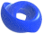

<p align="center">
  
</p>

<h1 align="center">SURFACE</h1>

<p align="center">
  <strong>Real-time parametric surface explorer powered by BabylonJS and GLSL</strong>
</p>

<p align="center">
  <a href="#features">Features</a> &bull;
  <a href="#getting-started">Getting Started</a> &bull;
  <a href="#usage">Usage</a> &bull;
  <a href="#keyboard-shortcuts">Shortcuts</a> &bull;
  <a href="#project-structure">Structure</a> &bull;
  <a href="#license">License</a>
</p>

---

SURFACE is a browser-based tool for creating, exploring and exporting parametric surfaces. Write a mathematical equation **f(u, v)** and watch the 3D mesh update in real time. Customize colors with GLSL shaders, apply symmetries, animate with time, and export to OBJ/STL for 3D printing.

## Features

- **Parametric equations** &mdash; Define surfaces with X(u,v), Y(u,v), Z(u,v) in Cartesian, Spherical or Cylindrical coordinates
- **50+ built-in surfaces** &mdash; Torus, Mobius, Catenoid, Klein Bottle, and many more
- **GLSL shader editors** &mdash; Two Monaco-based editors for fragment (color) and normal deformation shaders
- **Shorthand notation** &mdash; Write `cu` instead of `cos(u)`, implicit multiplication (`2u` &rarr; `2*u`), and 20+ custom functions (`m()`, `o()`, `f()`, `a()`, `b()`, `ce()`, etc.)
- **Symmetrize** &mdash; Repeat the mesh along X/Y/Z axes with angle control and checkerboard patterns
- **Transformations** &mdash; Scale, rotate, translate, and center-symmetry controls
- **Wave deformation** &mdash; Normal-based wave displacement with per-axis amplitude and frequency
- **Blender** &mdash; Blend surface components with per-axis control
- **Color system** &mdash; Theme randomization, UI/mesh color pickers, color addition and tint
- **Time animation** &mdash; Animated surfaces with play/pause, speed control, and the `t` variable
- **Import / Export** &mdash; JSON (full scene), OBJ and STL formats; shader import/export as .js files
- **Video recording** &mdash; Record the canvas as WebM video with crop box
- **Fully client-side** &mdash; No server required, runs entirely in the browser

## Getting Started

### Prerequisites

A modern browser with WebGL2 support (Chrome, Firefox, Edge, Safari 15+).

### Run locally

```bash
git clone https://github.com/remi1230/surface.git
cd surface
```

Open `index.html` in your browser, or serve it with any static server:

```bash
# Using Python
python -m http.server 8000

# Using Node.js
npx serve .
```

Then open [http://localhost:8000](http://localhost:8000).

> No build step or dependencies to install &mdash; all libraries are loaded from CDN.

## Usage

### Writing equations

Enter parametric equations in the **X**, **Y**, **Z** input fields on the left panel. Available variables:

| Variable | Description |
|----------|-------------|
| `u`, `v` | Parametric coordinates |
| `t` | Time (animated) |
| `A` &ndash; `M` | Adjustable mesh variable sliders |
| `pi`, `ep` | &pi; and Euler's number |

### Shorthand examples

| You write | Expands to |
|-----------|------------|
| `cu` | `cos(u)` |
| `sv` | `sin(v)` |
| `cufv` | `cos(u*v)` |
| `2u` | `2*u` |
| `m` | `m()` &mdash; multiplicative cosine deformation |
| `R` | `h(x,y,z)` &mdash; distance from origin |

### Deformation functions

| Function | Formula |
|----------|---------|
| `m(c)` | cos(cx) &times; cos(cy) &times; cos(cz) |
| `o(c)` | cos(cx) + cos(cy) + cos(cz) |
| `f(nc, np)` | cos(nc&middot;x + np) &times; cos(nc&middot;y + np) &times; cos(nc&middot;z + np) |
| `a(n)` | cos(n&middot;u) &times; sin(n&middot;v) |
| `b(c)` | length(cos(cx), cos(cy), cos(cz)) |
| `ce(c)` | cos(e^(c\|x\|)) &times; cos(e^(c\|y\|)) &times; cos(e^(c\|z\|)) |
| `q(a, b, t)` | mix (linear interpolation) |
| `r(e0, e1, x)` | smoothstep |
| `g(edge, x)` | step |
| `h(x, y, z)` | Euclidean distance |

See the in-app **HELP** button for the complete reference.

## Keyboard Shortcuts

| Key | Action |
|-----|--------|
| `+` / `-` | Zoom in / out |
| `h` | Randomize colors |
| `$` | Generate random surface |
| `a` | Toggle pause / play |
| `f` / `q` | Double / halve time speed |
| `7`/`8` | Animate U &minus;/+ |
| `4`/`5` | Animate V &minus;/+ |
| `u` / `j` | Increase / decrease resolution |
| `Shift+H` | Center camera |
| `Shift+B` | Toggle wireframe |
| `Shift+V` | Align camera to axis |
| `c` | Cinematic travelling camera |
| `w` | Walk on the surface (first person) |
| `Shift+W` | Walk on autopilot (surface travelling) |

### Walking on the surface

Press `w` to drop a character onto the mesh and explore it from the inside.

| Key | Action |
|-----|--------|
| Arrows | Move forward / back, turn |
| `Shift` + `↑` / `↓` | Raise / lower the viewpoint |
| `Space` | Jump |
| Mouse | Look around (click the canvas first) |
| `R` | Ride a rail: glide along the parameter line that closes on itself |
| `X` | Switch to the other side of the surface |
| `PageUp` / `PageDown` | Walking speed |
| `Shift+F` | Fullscreen video take (see below) |
| `Esc` | Back to the orbit camera |

Viewpoint height is a multiplier, so it survives a change of form or resolution, and it
changes nothing else: walking speed, gravity and jump height stay tied to the character's
own size, not to where the camera sits. Rise far enough and you get an overview of the
form while still travelling across its surface.

The ground is the surface as it is actually drawn &mdash; symmetries, blender, deformations,
mesh transformations and time animation included &mdash; because each frame samples the very
vertex shader used for rendering. Walking straight follows a **geodesic**, not a parameter
line, and speed is constant in world units rather than in `u`/`v`, so distorted regions of
the parameterization really do take longer to cross. On a surface that closes on itself
(a torus, a sphere) the domain edges loop seamlessly; on an open patch the border turns
you around.

### Fullscreen video from the surface

`Shift+F` while walking records a take. The view goes fullscreen, every overlay steps
aside, and the **whole frame** is captured &mdash; unlike the orbit take, which crops the
centred square set by the video box range. The clip downloads as WebM when the take ends.

**The take opens on a still frame, under your control** — no drifting off the moment
recording starts, so there is room for an establishing beat. Drive it with the arrows,
look around with the mouse, adjust the viewpoint height, jump: everything works while
recording.

Press `R` when you want the **automatic looping lap**. The character glides along the
parameter direction that closes on itself and the take stops by itself after exactly one
period, so the last frame joins the first and the clip loops seamlessly. A lap aims for
about 24 seconds (`WALK.CINEMA_LAP_SECONDS`), the speed derived from the measured length
of the path.

While a rail is running:

- **The mouse still looks around.** Horizontal motion turns the head, not the body, so
  the rail carries on along its line — a dolly with a free head. A steady offset leaves
  the loop closed, since the first and last frames share it.
- **The arrows take the wheel**, cruise-control style: the direction you were looking at
  becomes the heading, so nothing snaps, and you drive the rest of the take yourself.
  Recording continues; the badge switches to `you drive`, because a hand-driven path has
  no reason to close.
- **`Shift` + `↑`/`↓` reframes without cancelling anything** — height is a framing
  control, like the pitch, so it leaves the loop armed.

One caveat, and the badge says so during the take: the rail closes the *path*, not the
*shape*. If the surface deforms over time, it has moved on by the end of the lap and the
clip will still jump on repeat. Set `glo.walkCinema.freezeTime = true` to pause the
animation for the take and get a genuinely seamless loop, at the cost of the movement.

See the in-app HELP for the full list.

## Project Structure

```
surface/
├── index.html              # Main application page
├── logo.png                # App logo
├── LICENSE                 # MIT License
├── css/
│   ├── surface.css         # Main stylesheet
│   ├── monaco.css          # Shader editor styles
│   └── materialize-icons.css
├── js/
│   ├── bab.js              # BabylonJS scene setup and render loop
│   ├── glo.js              # Global state and configuration
│   ├── gui.js              # GUI panels, sliders, buttons (BabylonJS GUI)
│   ├── ui.js               # UI helpers, font styling, video recording
│   ├── ui-components.js    # Reusable UI component factories
│   ├── events.js           # Keyboard/mouse event handlers
│   ├── forms.js            # Built-in parametric surface definitions
│   ├── ribbon.js           # Mesh generation (paths, ribbon, normals)
│   ├── colors.js           # Color themes and randomization
│   ├── grid.js             # 3D grid and axis display
│   ├── modals.js           # Modal dialogs (export, import, help)
│   ├── prototypes.js       # Array/object prototype extensions
│   ├── GPUShaderMesh.js    # GPU shader mesh (GLSL generation, compilation)
│   ├── shaders-frags.js    # Fragment shader code and definitions
│   ├── shaders-crud.js     # Shader CRUD system (create, save, delete, import/export)
│   └── shaders-loader.js   # Shader loading from server/localStorage
├── json/
│   └── import-exemples/    # Example surfaces (JSON)
└── fonts/                  # Bundled fonts
```

## Technologies

- [BabylonJS](https://www.babylonjs.com/) &mdash; 3D rendering engine
- [BabylonJS GUI](https://doc.babylonjs.com/features/featuresDeepDive/gui) &mdash; In-canvas UI controls
- [Monaco Editor](https://microsoft.github.io/monaco-editor/) &mdash; Code editor for GLSL shaders
- WebGL2 / GLSL &mdash; GPU-accelerated rendering and custom shaders

## License

[MIT](LICENSE)
